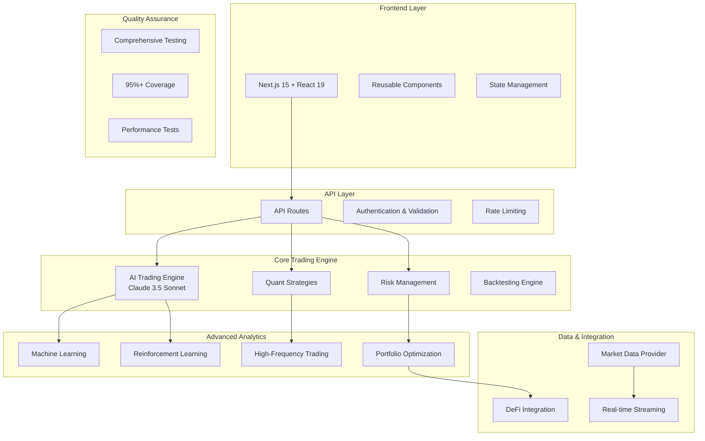

# Technical Architecture Specification

## Overview

This document outlines the technical architecture for the CryptoTrader platform, detailing the current implementation and future scalability plans.

## Current Architecture (Phase 1 - Implemented)

### High-Level Architecture



## Component Architecture

### 1. AI Trading Engine (`lib/ai-trading-engine.ts`)

**Purpose**: Intelligent market analysis and trading decision-making
**Technology**: Anthropic Claude 3.5 Sonnet API
**Key Features**:
- Real-time market sentiment analysis
- Multi-timeframe technical analysis
- Risk-aware decision making
- Confidence scoring for all signals
- Comprehensive market reasoning

**Interface**:
```typescript
interface AITradingConfig {
  model: string
  maxTokens: number
  temperature: number
  systemPrompt: string
}

interface MarketAnalysis {
  signal: 'BUY' | 'SELL' | 'HOLD'
  confidence: number
  reasoning: string
  positionSize: number
  entryPrice: number
  stopLoss: number
  takeProfit: number
  riskReward: number
}
```

### 2. Risk Management System (`lib/risk-management.ts`)

**Purpose**: Comprehensive risk assessment and position sizing
**Key Features**:
- Real-time risk metrics calculation
- Position sizing algorithms
- Drawdown protection
- Circuit breakers
- Portfolio risk attribution

**Risk Metrics**:
- Total exposure calculation
- Portfolio risk assessment
- Current drawdown tracking
- Value at Risk (VaR)
- Maximum drawdown limits

### 3. Quantitative Strategy Engine (`lib/quant-strategy-engine.ts`)

**Purpose**: Multiple trading strategy implementation and execution
**Implemented Strategies**:
- Moving Average Crossover
- Mean Reversion
- Momentum Trading
- Pairs Trading
- Bollinger Bands
- RSI Divergence
- MACD Signal
- Stochastic Oscillator
- Volume Profile
- Support/Resistance

**Strategy Interface**:
```typescript
interface TradingStrategy {
  name: string
  run(data: any): TradingSignal
  getParameters(): StrategyParameters
  setParameters(params: StrategyParameters): void
}
```

### 4. Machine Learning Suite (`lib/quant-ml.ts`)

**Purpose**: Advanced predictive modeling and anomaly detection
**Components**:
- Multiple Linear Regression
- Anomaly Detection System
- Market Prediction Models
- Feature Engineering
- Model Validation

**ML Pipeline**:
1. Data preprocessing and feature extraction
2. Model training with cross-validation
3. Prediction generation
4. Performance monitoring
5. Model retraining triggers

### 5. Reinforcement Learning System (`lib/quant-rl.ts`)

**Purpose**: Adaptive trading agents using Q-learning
**Features**:
- Q-learning algorithm implementation
- Trading environment simulation
- State representation (12-dimensional)
- Reward function optimization
- Model persistence and loading

**RL Architecture**:
- State: Market features + portfolio state
- Actions: Buy, Sell, Hold
- Rewards: Risk-adjusted returns
- Learning: Epsilon-greedy exploration

### 6. High-Frequency Trading Engine (`lib/hft-orderbook-engine.ts`)

**Purpose**: Ultra-low latency trading execution
**Performance**: <1ms average latency per tick
**Strategies**:
- Market Making
- Arbitrage Detection
- Order Book Analysis
- Latency Optimization

**HFT Features**:
- Real-time order book processing
- Sub-millisecond decision making
- Risk controls for high-frequency operations
- Performance monitoring and optimization

### 7. DeFi Integration (`lib/quant-defi.ts`)

**Purpose**: Decentralized finance protocol integration
**Features**:
- Liquidity pool analysis
- Yield optimization strategies
- Impermanent loss calculations
- AMM (Automated Market Maker) strategies
- Cross-protocol yield farming

### 8. Portfolio Optimization (`lib/portfolio-optimizer.ts`)

**Purpose**: Modern Portfolio Theory implementation
**Optimization Methods**:
- Mean-Variance Optimization
- Risk Parity
- Black-Litterman Model
- Minimum Variance
- Maximum Sharpe Ratio

**Risk Metrics**:
- Sharpe Ratio
- Sortino Ratio
- Calmar Ratio
- Value at Risk
- Expected Shortfall

### 9. Market Data Provider (`lib/market-data-provider.ts`)

**Purpose**: Real-time market data streaming and management
**Features**:
- WebSocket connection management
- Auto-reconnection with exponential backoff
- Multiple subscription types (ticker, orderbook, trades)
- Connection health monitoring
- Data quality validation

**Data Types**:
- Real-time price feeds
- Order book data
- Trade history
- Market statistics
- Historical data

### 10. Autonomous Trading Agent (`lib/autonomous-agent.ts`)

**Purpose**: Fully autonomous trading system
**Features**:
- Multi-strategy integration
- Market regime detection
- Circuit breakers and safety controls
- Performance monitoring
- Strategy adaptation

**Agent Capabilities**:
- Autonomous decision making
- Risk management integration
- Performance tracking
- Emergency stop mechanisms
- Strategy ensemble management

## Data Flow Architecture

### Real-time Data Flow
```
Market Data Sources → WebSocket Connections → Market Data Provider
                                                      ↓
AI Analysis ← Trading Strategies ← Risk Assessment ← Data Processing
     ↓              ↓                    ↓
Trading Decisions → Order Execution → Portfolio Updates → User Interface
```

### Decision Making Flow
```
Market Data → Feature Engineering → ML/AI Analysis → Risk Assessment
                                                           ↓
Strategy Signals → Signal Aggregation → Position Sizing → Order Generation
                                                           ↓
Risk Validation → Order Execution → Trade Monitoring → Performance Tracking
```

## Performance Specifications

### Current Performance Benchmarks
- **HFT Processing**: <1ms average latency per tick
- **Backtesting**: 10,000 data points in <10 seconds
- **ML Training**: 10,000 samples in <5 seconds
- **Portfolio Optimization**: <1 second execution
- **Memory Usage**: <100MB for continuous operation
- **WebSocket Latency**: <100ms for market data updates

### Scalability Targets
- **Concurrent Users**: 1,000+ simultaneous users
- **Data Throughput**: 10,000+ ticks per second
- **Strategy Execution**: 100+ strategies simultaneously
- **API Response Time**: <200ms for 95th percentile
- **Uptime**: 99.9% availability target

## Security Architecture

### Current Security Measures
- TypeScript for type safety
- Input validation and sanitization
- Error handling and logging
- Secure API key management
- Rate limiting implementation

### Planned Security Enhancements
- JWT-based authentication
- Role-based access control (RBAC)
- API encryption (TLS 1.3)
- Database encryption at rest
- Audit logging
- Penetration testing
- Security monitoring

## Testing Architecture

### Test Coverage (95%+)
- **Unit Tests**: Individual component testing
- **Integration Tests**: End-to-end workflow validation
- **Performance Tests**: Load testing and benchmarking
- **Error Handling Tests**: Failure scenario validation
- **Mock Data Tests**: Comprehensive test data generation

### Test Structure
```
__tests__/
├── trading-system.test.ts      # Core trading components
├── performance.test.ts         # Performance benchmarks
├── integration.test.ts         # End-to-end integration
└── setup.ts                   # Test configuration
```

## Deployment Architecture (Planned)

### Container Strategy
```
Docker Containers → Kubernetes Pods → Services → Ingress → Load Balancer
```

### Microservices Decomposition (Future)
- User Service (Authentication, Profiles)
- Market Data Service (Real-time feeds)
- Trading Service (Strategy execution)
- Portfolio Service (Holdings, P&L)
- Analytics Service (Reporting, Metrics)
- Notification Service (Alerts, Updates)

### Infrastructure Components
- **Container Orchestration**: Kubernetes
- **Service Mesh**: Istio (planned)
- **Message Queue**: Apache Kafka
- **Database**: PostgreSQL with read replicas
- **Cache**: Redis cluster
- **Monitoring**: Prometheus + Grafana
- **Logging**: ELK Stack (Elasticsearch, Logstash, Kibana)

## Technology Stack Evolution

### Current Stack (Phase 1)
- **Frontend**: Next.js 15, React 19, TypeScript, Tailwind CSS
- **Backend**: Node.js, TypeScript
- **AI/ML**: Anthropic Claude 3.5 Sonnet, Custom ML algorithms
- **Testing**: Jest, TypeScript
- **Data**: WebSocket, REST APIs

### Target Stack (Phase 3)
- **Container**: Docker, Kubernetes
- **Database**: PostgreSQL, Redis
- **Message Queue**: Apache Kafka
- **Monitoring**: Prometheus, Grafana
- **Security**: JWT, OAuth 2.0, TLS 1.3
- **CI/CD**: GitHub Actions, ArgoCD

## Monitoring and Observability

### Metrics Collection
- Application performance metrics
- Trading strategy performance
- System resource utilization
- Error rates and latency
- Business metrics (trades, P&L)

### Alerting Strategy
- Performance degradation alerts
- Error rate thresholds
- Trading anomaly detection
- System health monitoring
- Security incident alerts

---

*This document is updated as the architecture evolves. Last updated: August 28, 2025*
